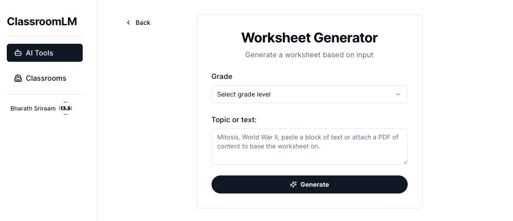

# [ClassroomLM](https://classroom-lm.vercel.app/)

A [WIP clone](https://classroom-lm.vercel.app/) of MagicSchool.ai where tools store aggregated structured knowledge from student interactions.

This knowledge will be used by tools in further interactions for student and teacher facing tools to personalise the outputs.

The backend repo can be found [here](https://github.com/13point5/classroom-lm-poc).

## Tech Stack

- [Next.js](https://nextjs.org/) - React Framework
- [Shadcn](https://ui.shadcn.com/) - UI component library
- [Vercel Postgres](https://vercel.com/docs/storage/vercel-postgres) - Database
- [Clerk](https://clerk.com/) - Authentication
- [Instructor](https://python.useinstructor.com/) - Structured Output Extraction
- [LangChain](https://python.langchain.com/v0.2/docs/introduction/) - LLM Framework
